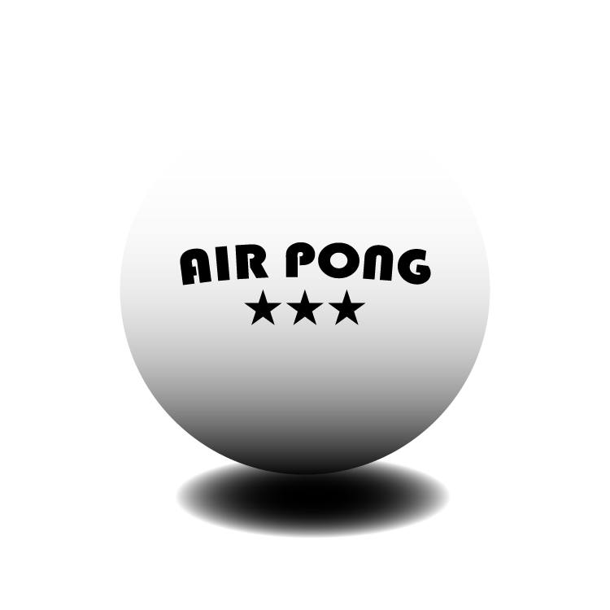

---
#
# By default, content added below the "---" mark will appear in the home page
# between the top bar and the list of recent posts.
# To change the home page layout, edit the _layouts/home.html file.
# See: https://jekyllrb.com/docs/themes/#overriding-theme-defaults
#
layout: home
---



<video controls src="assets/rick_roll.MP4" title="Title"></video>
## About

We set out to create a ping pong simulator game that allows a player to
physically mime Pong Pong paddle motions to interact with the game. We wanted
to challenge ourselves in doing accurate ping pong physical simulation and monocular
computer vision.

## structure

## Setup
### Clone the Github repository
Clone the github repository to your local machine using your desired method. Navigate to the folder in terminal.
```
git clone <PROJECT KEY OR HTTP>
```

If you don't know how or require further resources on cloning Github repositories, [use this resources](https://docs.github.com/en/repositories/creating-and-managing-repositories/cloning-a-repository)
To install MediaPipe and all the other dependencies, open the project folder and run:

### Create a conda env (highly recommended)
To isolate dependencies and python versions, create a conda environment that uses python 3.10.

Use the following command to create
```
conda create -n <NAME_OF_ENV> python==3.10
```

Use the following command to activate
```
conda activate <NAME_OF_ENV>
```
Note that NAME_OF_ENV must be identical to the previous name you input however it doesn't matter which folder you are in when you activate.

### Install requirements
The final setup step is installing the requirements. Make sure you are in the root folder of the repository before running the following command.

```
pip install -r requirements.txt
```

## Playing the game

### Running
1. Navigate to the repository root folder. 
2. Make sure all setup instructions are followed and the conda env is activated. 
3. Run the following command
```
python3 main.py
```

Please note that the program requires a fast single thread CPU. If the code runs but is very slow it is a hardware limitation.

### Game rules

Welcome to AIR-PONG, the best way of playing 1v1 Ping Pong on the go. You may look a bit silly while playing, but trust me - it really changes your ping pong game.

Before we begin, let's lay some ground truths.
* Each player must control with a different hand
    * Players using their right hand to play use WAD to control serve and rotation
    * Players using their left hand to play use arros UP, LEFT and RIGHT to control serve and rotation
* Games are played until 11 points, win by 2, serve switches every 2
* Only one player can rotate their paddle at a time

Now you can start playing! Good luck!

## Authors

[comment]: <> (Julian)
<div style="display: flex; align-items: center;">
  <!-- Left Column: Circular Image -->
  <div style="width: 150px; height: 150px; border-radius: 50%; overflow: hidden; margin-right: 20px;">
    
  </div>

  <!-- Right Column: Text -->
  <div>
    <p>Julian Shah</p>
    <p>A robotics engineer and programmer from Seattle WA (really likes coffee)</p>
  </div>
</div>


[comment]: <> (Ansel)
<div style="display: flex; align-items: center;">
  <!-- Left Column: Circular Image -->
  <div style="width: 150px; height: 150px; border-radius: 50%; overflow: hidden; margin-right: 20px;">
    
  </div>

  <!-- Right Column: Text -->
  <div>
    <p>Lorem ipsum dolor sit amet, consectetur adipiscing elit.</p>
    <p>Sed tristique, odio a feugiat placerat.</p>
  </div>
</div>


[comment]: <> (Lukas)
<div style="display: flex; align-items: center;">
  <!-- Left Column: Circular Image -->
  <div style="width: 150px; height: 150px; border-radius: 50%; overflow: hidden; margin-right: 20px;">
    
  </div>

  <!-- Right Column: Text -->
  <div>
    <p>Lorem ipsum dolor sit amet, consectetur adipiscing elit.</p>
    <p>Sed tristique, odio a feugiat placerat.</p>
  </div>
</div>


## Attribution

- This project runs using Google's open source project [MediaPipe](https://ai.google.dev/edge/mediapipe/solutions/guide).
- This project makes heavy use of pygame for visuals
- This project makes heavy use of pynput for keyboard inputs
- This project makes heavy use of vpython for physics and math